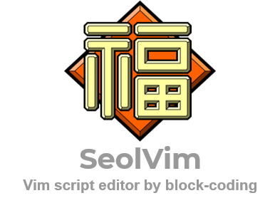
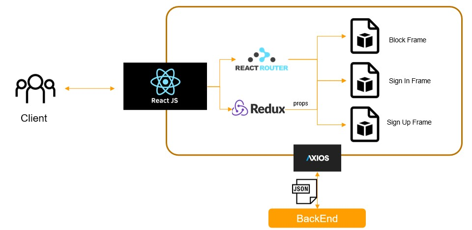

# 2021-2 Capstone Project Front-end (React.js) #

<p align="center"></p>

## About SeolVim project ##
* Create Vim script (e.g. .vimrc) by block coding.
* By enabling [google/blockly](https://github.com/google/blockly) to support the Vim language, we expect more people interested in using Vim, can easily configure vim to suit their own taste.

[comment]: <> (SeolVim 사진넣기)

## DEV environment ##
* Windows
* Linux (native Ubuntu 18.04LTS, WSL2 Ubuntu 20.04LTS)
* Git
* React JS
* you can find additional npm libraries (such as Redux, Axios) in the source

## How to download project ##
```bash
$ git clone https://github.com/SeolVim/SeolVim_Frontend.git
$ cd SeolVim_Frontend
```
* If you want fully-functioning project of SeolVim, you need to download [SeolVim Backend](https://github.com/SeolVim/SeolVim_Backend) and run the backend.

## Installation & Run ##
1. npm install
2. yarn start  

    or ... just simply run the code below in terminal.
```bash
 $ sh run_SVfront.sh
 ```

[comment]: <> (Linux에서 실행시키는 방법, Windows에서 실행시키는 방법으로 구분하여 적어넣기)

## SeolVim web preview ##
*  By web browser, you can test SeolVim locally by the url below.
 ```url
http://localhost:3000/
 ```

## Vim blocks usage ##
* Simply drag-and-drop the blocks from tool box to workspace.
* If you want to export your blocks to vim language, click the exporting button.

## Project Structure ##


[comment]: <> (프로젝트의 구조를 넣기)

## Contributing to SeolVim ##
* If you are intrested in improving SeolVim experience, we welcome contributions to Seolvim in the form of pull requests, bug reports, github issues and more!
* You might also want to look for help or question, feel free to contact us!

## Translations of this README ##
[Korean - currently not supported](./README.md)

[comment]: <> (README_ko.md 만들기 - 우선순위 하)
